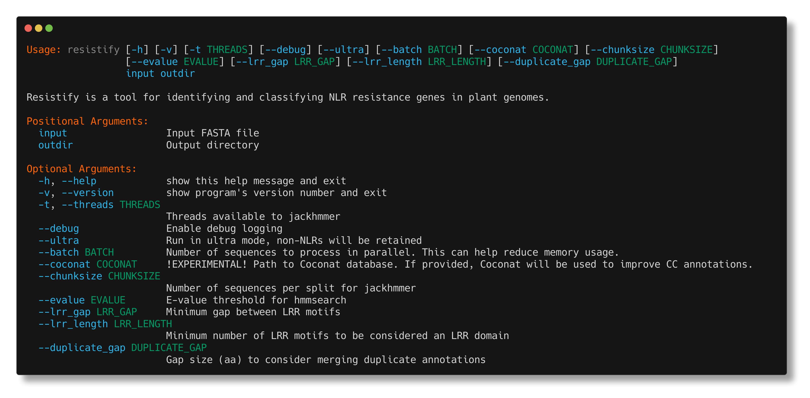

# Resistify


Resistify is a program which classifies plant NLRs by their protein domain and motif architecture.
It is designed to be lightweight - no manual database installations or tricky dependencies here!




## Installation

Resistify is available on [Conda](https://anaconda.org/bioconda/resistify):

`conda install -c bioconda resistify`

Resistify is also available on [PyPi](https://pypi.org/project/resistify/):

`pip install resistify`

Resistify requires [hmmer](http://hmmer.org) as a dependency.


## Usage

To get started with Resistify:

```
resistify <input.fa> <output_directory>
```

Your `input.fa` should contain your protein sequences of interest.
An `output_directory` will be created which will contain the results of your run:
 - `results.tsv` - A table containing the primary results of Resistify.
 - `motifs.tsv` - A table of all the NLR motifs identified for each sequence.
 - `domains.tsv` - A table of all the domains identified for each sequence.
 - `nbarc.fasta` - A fasta file of all the NB-ARC domains identified.

Here's an example of the `results.tsv` for ZAR1:

|Sequence | Length | Motifs | Domains | Classification | NBARC_motifs | MADA | MADAL | CJID |
|--- | --- | --- | --- | --- | --- | --- | --- | --- |
|ZAR1 | 852 | CNNNNNNNNNLLLLLLLLLL | CNL | CNL | 9 | False | True | False |

The main column of interest is "Classification".
The "Motifs" column indicates the series of NLR-associated motifs identified across the sequence.
This can be useful for interpreting non-canonical NLRs!

### Ultra mode

By default Resistify will perform an initial filter to remove non-NLRs prior to motif identification.
Highly degraded or non-canonical NLRs may not be reported.
If you wish to retain these, simply use `--ultra` mode to skip this step.

## How does it work?

Resistify is a two step process.

First, all sequences are searched for CC, RPW8, TIR, and NB-ARC domains.
This is used to quickly filter out any non-NLR sequences and identify the primary architecture of each NLR.

Secondly, each potential NLR sequence is scanned for CC, TIR, NB-ARC, and LRR associated motifs via NLRexpress. 
These are used as an additional layer of evidence to reclassify each NLR by predicting LRR domains, and predicting any CC or TIR domains which may have been missed in the initial `hmmsearch`.

Resistify will also search for N-terminal MADA motifs and CJID domains that are common to CNLs and TNLs respectively.

## A note on run time

Version 0.1.1 has introduced multithreading 🎉 - use the `--threads` argument to get started.

The run time of `resistify` scales linearly with the total number of NLRs present in the input sequence file.
A file with 200 NLRs will take approximately twice as long as a file with 100 NLRs.
This does not apply to the total number of *sequences* - an input of 50,000 sequences with 100 NLRs will run just as fast as an input of 1,000 sequences with 100 NLRs.

## Contributing

Contributions are greatly appreciated!
If you experience any issues running Resistify, please get in touch via the Issues page.
If you have any suggestions for additional features, get in touch!

## Citing

```
Resistify - A rapid and accurate annotation tool to identify NLRs and study their genomic organisation
Moray Smith, John T. Jones, Ingo Hein
bioRxiv 2024.02.14.580321; doi: https://doi.org/10.1101/2024.02.14.580321
```

You must also cite:

```
NLRexpress—A bundle of machine learning motif predictors—Reveals motif stability underlying plant Nod-like receptors diversity
Martin Eliza C. , Spiridon Laurentiu , Goverse Aska , Petrescu Andrei-José
Frontiers in Plant Science 2022; doi: https://doi.org/10.3389/fpls.2022.975888
```
