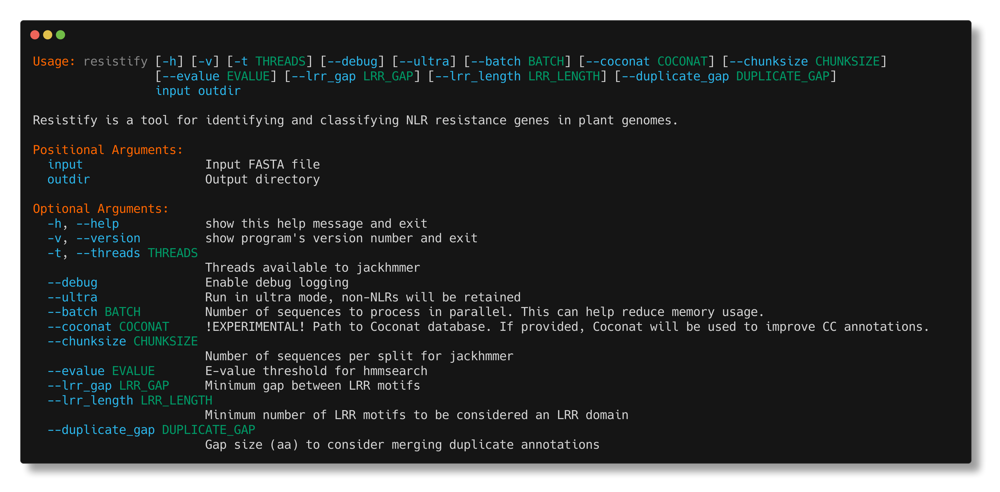
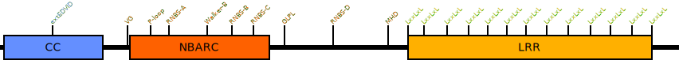
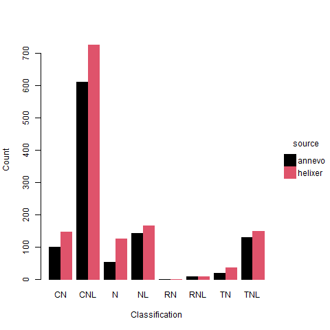

<div align="center">

# Resistify 🍃

[](https://anaconda.org/bioconda/resistify)
[](https://anaconda.org/bioconda/resistify)
[](https://anaconda.org/bioconda/resistify)

</div>

Resistify is a program which rapidly identifies and classifies plant resistance genes from protein sequences.
It is designed to be lightweight and easy to use.



## What's new in version two?

### Speeeeed

`v2.0.0` has introduced a full reimplementation of NLRexpress that uses [ESM2 8M](https://github.com/facebookresearch/esm) embeddings instead of `jackhmmer`.
It is ~60x faster, uses ~10x less memory, and should be slightly more accurate - full benchmarks are available below.

As part of this, I have (for now) removed the TIR motif predictors.
I'll aim to reinclude these, but they were never critical for classification as they are so conserved.
If you really need these, let me know and I'll add them back in...

### New plotting method

By default, `Resistify` now creates individual SVG plots of sequences in the results folder.
I decided to replace the matplotlib method because it was a bit clunky, and SVG should be sufficient for most purposes.

### More HMMs

I pulled additional NLR-associated HMMs from Pfam-A into the `Resistify` database (e.g., more LRR HMMs), so you'll see more hits for these in `annotations.tsv`.
This shouldn't affect classifications, but expect domain boundaries to change slightly.

### General refactoring

Result formats have changed slightly, refer to the latest README.md (here!) for up to date outputs.

*There might be some bugs!*
*Please raise an issue if you spot a missing feature, or any unexpected problems.*

## Getting started

### Conda

`Resistify` is available via the [Bioconda](https://anaconda.org/bioconda/resistify) channel:

```
conda create -n resistify resistify
conda activate resistify
```

> [!NOTE]
> If you want to use the GPU-accelerated pipelines, conda may fail to install a GPU-ready version of `pytorch`. If this occurs, try adding `pytorch-gpu` to the conda environment.

### Singularity

Containers are also available through the [biocontainers repository](https://quay.io/repository/biocontainers/resistify?tab=tags).
To use these with `singularity`, simply run:

`singularity exec docker://quay.io/biocontainers/resistify:<tag-goes-here> resistify`

## Usage

### Identifying NLRs

To predict NLRs within a set of protein sequences, simply run:

```bash
resistify nlr $PROTEIN_FASTA -o $RESULTS_DIR
```

and `Resistify` will identify and classify NLRs, and return some files:
 - `results.tsv` - A table containing the primary results of `Resistify`.
 - `motifs.tsv` - A table of all the NLR motifs identified for each sequence.
 - `domains.tsv` - A table of all the domains identified for each sequence.
 - `annotations.tsv` - A table of the raw annotations for each sequence.
 - `nbarc.fa` - A fasta file of all the NB-ARC domains identified.
 - `nlr.fa` - A fasta file of all NLRs identified.

By default, `Resistify` will only return sequences with identifiable NB-ARC domains.
If you wish to identify highly fragmented NLRs, you can use the `--retain` option which will predict and report NLR-associated motifs for all sequences.

If you want to increase the sensitivity of coiled-coil domain annotation, you can use the option `--coconat`.
This will use [CoCoNat](https://doi.org/10.1093/bioinformatics/btad495) to predict coiled-coil domains.
In practice, I wouldn't expect this mode to pick up on a significant number of missed CC domains, but it can pick up on cryptic CCs that do not have an identifiable EDVID motif.

#### How does it work?

`Resistify` carries out an initial search for common NLR domains to quickly filter and annotate the input sequences.
Then, `Resistify` executes a re-implementation of `NLRexpress` to conduct a fast and accurate search for NLR-associated motifs.
If `--coconat` is used, this will also be executed to scavenge for potentially missed coiled-coil domains.
Together, this evidence is used to classify NLRs according to their domain architecture.

### Identifying PRRs

> [!IMPORTANT]
> This pipeline is currently in development - due to other commitments I can't currently benchmark this properly and make no guarantees to its accuracy yet! Feedback is appreciated.

To predict PRRs within a set of protein sequences, simply run:

```
resistify prr $PROTEIN_FASTA -o $RESULTS_DIR
```

and `Resistify` will identify and classify PRRs, and return some files:
 - `results.tsv` - A table containing the primary results of `Resistify`.
 - `motifs.tsv` - A table of all the LRR motifs identified for each sequence.
 - `domains.tsv` - A table of all the domains identified for each sequence.
 - `annotations.tsv` - A table of the raw annotations for each sequence.
 - `prr.fa` - A fasta file of all PRRs identified.

> [!WARNING]
> This pipeline is GPU-accelerated and will be slow on CPU only.

#### How does it work?

First, `Resistify` searches for domains associated with a [recently described classification system](https://doi.org/10.1016/j.molp.2024.02.014) for RLP/RLKs.
Then, a re-implementation of [`TMbed`](https://github.com/BernhoferM/TMbed) is used to predict transmembrane domains - sequences with a single α-helix transmembrane domain and an extracellular domain of at least 50 amino acids are considered as RLPs.
Finally, `NLRexpress` is used to identify LRR domains.

Sequences are classified as being either RLPs or RLKs depending on the presence of an internal kinase domain, and are classified according to their extracellular domain.

### Downloading model data

By default, model will be automatically downloaded to `$HOME/.cache` or `$XDG_CACHE_HOME` if it is set.
If you wish to download model data prior to running Resistify, this can be achieved by running:

```python
from huggingface_hub import snapshot_download
import esm

snapshot_download(repo_id="Synthyra/ESM2-8M", repo_type="model")

# only for tmbed and coconat models
snapshot_download(repo_id="Rostlab/prot_t5_xl_half_uniref50-enc", repo_type="model")
esm.pretrained.esm2_t33_650M_UR50D()
```

Models can then be used as long as `$XDG_CACHE_HOME` points to the cache directory where models were downloaded.

## Results

### results.tsv (nlr)

| Sequence | Length | LRR_Length | Motifs                  | Domains | Classification | NBARC_motifs | MADA  | CJID  |
| -------- | -------| ---------- | ----------------------- | ------- | -------------- | ------------ | ----- | ----- |
| ZAR1     | 852    | 306        | CNNNNNNNNNLLLLLLLLLLLLL | mCNL    | CNL            | 9            | False | False |

The main column of interest is "Classification", where we can see that it has been identified as a canonical CNL.
The "Motifs" column indicates the series of NLR-associated motifs identified across the sequence - this can be useful if an NLR has an undetermined or unexpected classification.
The columns "MADA", and "CJID" correspond to common NLR sequence signatures.

### results.tsv (prr)

| Sequence | Length | Extracellular_Length | LRR_Length | Type | Classification | Signal_peptide |
| --- | --- | --- | --- | --- | --- | --- |
| fls2 | 1173 | 806 | 675 | RLK | LRR | True |

For PRRs, sequences can be of the type RLP or RLK - both are single pass transmembrane proteins, and RLKs have an internal kinase domain.
Classification refers to the domains identified in the external region.
If multiple domains are identified, they will each be reported as a semi-colon separated list.
If a signal peptide is identified in the sequence, this is reported accordingly.

### motifs.tsv

| Sequence | Motif    | Position | Probability | Downstream_sequence | Motif_sequence | Upstream_sequence |
|----------|----------|----------|-------------|---------------------|----------------|-------------------|
| ZAR1     | extEDVID | 66       | 0.85        | LVADL               | RELVYEAEDILV   | DCQLA             |
| ZAR1     | VG       | 160      | 1.0         | YDHTQ               | VVGLE          | GDKRK             |
| ZAR1     | P-loop   | 189      | 1.0         | IMAFV               | GMGGLGKTT      | IAQEV             |
| ZAR1     | RNBS-A   | 212      | 1.0         | EIEHR               | FERRIWVSVS     | QTFTE             |
| ZAR1     | Walker-B | 260      | 1.0         | QYLLG               | KRYLIVMD       | DVWDK             |
| ZAR1     | RNBS-B   | 291      | 1.0         | RGQGG               | SVIVTTR        | SESVA             |
| ZAR1     | RNBS-C   | 318      | 1.0         | HRPEL               | LSPDNSWLLF     | CNVAF             |
| ZAR1     | GLPL     | 357      | 1.0         | VTKCK               | GLPLT          | IKAVG             |
| ZAR1     | RNBS-D   | 418      | 1.0         | SHLKS               | CILTLSLYP      | EDCVI             |
| ZAR1     | MHD      | 487      | 1.0         | IITCK               | IHD            | MVRDL             |
| ZAR1     | LxxLxL   | 512      | 0.96        | PEGLN               | CRHLGI         | SGNFD             |
| ZAR1     | LxxLxL   | 532      | 0.89        | KVNHK               | LRGVVS         | TTKTG             |
| ZAR1     | LxxLxL   | 561      | 1.0         | TDCKY               | LRVLDI         | SKSIF             |
| ZAR1     | LxxLxL   | 588      | 1.0         | ASLQH               | LACLSL         | SNTHP             |
| ZAR1     | LxxLxL   | 612      | 1.0         | EDLHN               | LQILDA         | SYCQN             |
| ZAR1     | LxxLxL   | 636      | 1.0         | VLFKK               | LLVLDM         | TNCGS             |
| ZAR1     | LxxLxL   | 660      | 1.0         | GSLVK               | LEVLLG         | FKPAR             |
| ZAR1     | LxxLxL   | 686      | 1.0         | KNLTN               | LRKLGL         | SLTRG             |
| ZAR1     | LxxLxL   | 713      | 1.0         | INLSK               | LMSISI         | NCYDS             |
| ZAR1     | LxxLxL   | 741      | 1.0         | TPPHQ               | LHELSL         | QFYPG             |
| ZAR1     | LxxLxL   | 766      | 1.0         | HKLPM               | LRYMSI         | CSGNL             |
| ZAR1     | LxxLxL   | 793      | 1.0         | NTHWR               | IEGLML         | SSLSD             |
| ZAR1     | LxxLxL   | 818      | 1.0         | QSMPY               | LRTVTA         | NWCPE             |

Here, the positions, probabilities, and sequence of NLRexpress motif hits are listed.
The five amino acids upstream and downstream of the motif site are also provided.
In PRR mode, only LRR motifs will be reported.

### domains.tsv

| Sequence | Domain | Start | End |
|----------|--------|-------|-----|
| ZAR1     | MADA   | 1     | 21  |
| ZAR1     | CC     | 5     | 128 |
| ZAR1     | NBARC  | 163   | 337 |
| ZAR1     | LRR    | 512   | 817 |

This file contains the coordinates of the domains identified by `Resistify`.

### annotations.tsv

| Sequence | Domain | Start | End | Accession  | Score  | Source    |
|----------|--------|-------|-----|------------|--------|-----------|
| ZAR1     | MADA   | 1     | 21  | CC_motif_1 | 16.2   | hmmer     |
| ZAR1     | CC     | 5     | 128 | PF18052    | 69.72  | hmmer     |
| ZAR1     | NBARC  | 163   | 337 | PF00931    | 196.02 | hmmer     |
| ZAR1     | LRR    | 512   | 817 |            |        | resistify |
| ZAR1     | LRR    | 541   | 781 | PF23598    | 99.53  | hmmer     |
| ZAR1     | LRR    | 676   | 808 | PF25019    | 31.39  | hmmer     |

This file contains the raw annotations for each sequence, and the method which was used to identify them.

### plots.tar.gz

By default, `Resistify` generates some rudimentary plots for each protein, saved as a `plots.tar.gz` archive.
You can disable these via `--no-draw` if ya want.



## Motif prediction accuracy

Below is the prediction accuracy of the current ESM2 8M NLRexpress models.

| Motif | Precision | Recall | F1 |
| ----- | --------- | ------ | -- |
| GLPL | 1.00 | 1.00 | 1.00 |
| LxxLxL | 0.96 | 0.91 | 0.94 |
| MHD | 0.99 | 0.98 | 0.99 |
| P-loop | 1.00 | 1.00 | 1.00 |
| RNBS-A | 0.99 | 0.98 | 0.99 |
| RNBS-B | 0.99 | 0.98 | 0.98 |
| RNBS-C | 1.00 | 1.00 | 1.00 |
| RNBS-D | 1.00 | 0.99 | 0.99 |
| VG | 0.98 | 0.97 | 0.97 |
| Walker-B | 1.00 | 0.99 | 1.00 |
| extEDVID | 0.99 | 0.98 | 0.99 |

## Frequently asked questions

**Q: Can `Resistify` be used to predict resistance genes from genomic data?**

**A:** Unfortunately, `Resistify` cannot be directly applied to a genome to predict resistance genes, unlike tools such as `NLR-Annotator`.
If gene annotations are unavailable for your genome, my advice would be to use a tool like [`Helixer`](https://github.com/weberlab-hhu/Helixer) or [`ANNEVO`](https://github.com/xjtu-omics/ANNEVO) to perform *ab initio* gene prediction first, then pass these to `Resistify`.
Currently, I find that `Helixer` tends to identify more NLRs than `ANNEVO` (in *Solanum*):



**Q: According to the Motif string, some of my genes have NLR motifs in unexpected places - are these significant?**

**A:** False positives do occur for the motif predictions, and unexpected predictions such as a single CC motif in the LRR domain are unlikely to be representative of a true domain annotation.
False positives shouldn't interfere with the classification accuracy.

## Benchmarks

The following are some quick benchmarks of the various `resistify` pipelines against the [DM potato genome](https://spuddb.uga.edu/data/DM_1-3_516_R44_potato.v6.1.hc_gene_models.pep.fa.gz) annotation, which contains 44,851 protein sequences.
Benchmarking was conducted on an HPC node called ["buckbeak"](https://help.cropdiversity.ac.uk/system-overview.html) with 16 threads and 1 A100 GPU made available.
CPU-only runtimes will be longer when `--coconat` is enabled, or on the PRR pipeline. 

| Pipeline        | CPU time | Real time | MaxRSS  |
| --------------- | -------- | --------- | ------- |
| `nlr`           | 339.1s   | 31.2s     | 1744 MB |
| `nlr --retain`  | 15709.4s | 1072.7s   | 2246 MB |
| `nlr --coconat` | 388.9s   | 75.9s     | 8339 MB |
| `prr`           | 5827.7s  | 1401.4s   | 4101 MB |

## Contributing

Contributions are greatly appreciated!
If you experience any issues running Resistify, please get in touch via the Issues page.
If you have any suggestions for additional features, get in touch!

## Citing

> Smith M., Jones J. T., Hein I. (2025) Resistify: A Novel NLR Classifier That Reveals Helitron-Associated NLR Expansion in Solanaceae. *Bioinformatics and Biology Insights*. 2025;19. [doi:10.1177/11779322241308944](https://doi.org/10.1177/11779322241308944)

You must also cite:

> Martin, E. C., Spiridon, L., Goverse, A., & Petrescu, A. J. (2022). NLRexpress—A bundle of machine learning motif predictors—Reveals motif stability underlying plant Nod-like receptors diversity. *Frontiers in Plant Science*, 13, 975888. https://doi.org/10.3389/fpls.2022.975888

If you use the `CoCoNat` module, please cite:

> Madeo, G., Savojardo, C., Manfredi, M., Martelli, P. L., & Casadio, R. (2023). CoCoNat: a novel method based on deep learning for coiled-coil prediction. *Bioinformatics*, 39(8), btad495. https://doi.org/10.1093/bioinformatics/btad495

If you use the PRR module, please cite:

> Bernhofer, M., & Rost, B. (2022). TMbed: transmembrane proteins predicted through language model embeddings. *BMC bioinformatics*, 23(1), 326. https://doi.org/10.1186/s12859-022-04873-x
