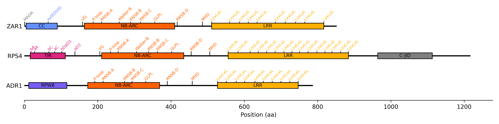

# Resistify


Resistify is a program which classifies plant NLRs by their protein domain and motif architecture.
It is designed to be lightweight - no manual database installations* or tricky dependencies here!

\**Optional database not included!*


## Installation

Resistify is available on [Conda](https://anaconda.org/bioconda/resistify):

`conda install -c bioconda resistify`

Docker/Podman containers are also available through the [biocontainers repository](https://quay.io/repository/biocontainers/resistify?tab=tags).
To use these with - for example - singularity, simply run:

`singularity exec docker://quay.io/biocontainers/resistify:<tag-goes-here>` 

## Usage

To get started with Resistify:

```
resistify <input.fa> <output_directory>
```

### CoCoNat-based CC annotation (EXPERIMENTAL)

Version 0.5.0 has introduced an optional module that will use [CoCoNat](https://doi.org/10.1093/bioinformatics/btad495) to improve the identification of CC domains.
To use this feature, you will first need to download their databases:

```
wget https://coconat.biocomp.unibo.it/static/data/coconat-plms.tar.gz
tar xvzf coconat-plms.tar.gz
```

Then, simply provide a path to the database folder with the argument `--coconat`.
CoCoNat will then be used to improve the annotation of coiled-coil domains in your input.

This uses a stripped down version of CoCoNat - currently it will only identify CC domain boundaries and not predict residue-level registers or oligomerization states.

### Ultra mode

By default `Resistify` will perform an initial filter to remove non-NLRs prior to motif identification.
Highly degraded or non-canonical NLRs may not be reported.
If you wish to retain these, simply use `--ultra` mode to skip this step.
You can use this to identify any NLR-associated motifs in a dataset.

## Results

Your `input.fa` should contain your protein sequences of interest.
An `output_directory` will be created which will contain the results of your run:
 - `results.tsv` - A table containing the primary results of `Resistify`.
 - `motifs.tsv` - A table of all the NLR motifs identified for each sequence.
 - `domains.tsv` - A table of all the domains identified for each sequence.
 - `annotations.tsv` - A table of the raw annotations for each sequence.
 - `nbarc.fasta` - A fasta file of all the NB-ARC domains identified.
 - `nlr.fasta` - A fasta file of all NLRs identified.

As an example, let's look at the results of a `Resistify` run against the NLR [ZAR1](https://www.ncbi.nlm.nih.gov/protein/15230357).

### results.tsv

| Sequence | Length | Motifs | Domains | Classification | NBARC_motifs | MADA | MADAL | CJID |
| --- | --- | --- | --- | --- | --- | --- | --- | --- |
| ZAR1 | 852 | CNNNNNNNNNLLLLLLLLLL | mCNL | CNL | 9 | False | True | False |

The main column of interest is "Classification", where we can see that it has been identified as a canonical CNL.
The "Motifs" column indicates the series of NLR-associated motifs identified across the sequence - this can be useful if an NLR has an undetermined or unexpected classification.
The columns "MADA", "MADAL", and "CJID" correspond to common NLR sequence signatures.
Here, it appears that ZAR1 has a MADA-like motif.

### motifs.tsv

| Sequence | Motif | Position | Probability | Downstream_sequence | Motif_sequence | Upstream_sequence |
| --- | --- | --- | --- | --- | --- | --- |
| ZAR1 | extEDVID | 65 | 0.9974 | LVADL | RELVYEAEDILV | DCQLA |
| ZAR1 | VG | 159 | 0.9924 | YDHTQ | VVGLE | GDKRK |
| ZAR1 | P-loop | 188 | 1.0 | IMAFV | GMGGLGKTT | IAQEV |
| ZAR1 | RNSB-A | 211 | 0.9981 | EIEHR | FERRIWVSVS | QTFTE |
| ZAR1 | Walker-B | 259 | 0.973 | QYLLG | KRYLIVMD | DVWDK |
| ZAR1 | RNSB-B | 290 | 0.9846 | RGQGG | SVIVTTR | SESVA |
| ZAR1 | RNSB-C | 317 | 0.9994 | HRPEL | LSPDNSWLLF | CNVAF |
| ZAR1 | RNSB-D | 417 | 0.9875 | SHLKS | CILTLSLYP | EDCVI |
| ZAR1 | GLPL | 356 | 0.9998 | VTKCK | GLPLT | IKAVG |
| ZAR1 | MHD | 486 | 0.9965 | IITCK | IHD | MVRDL |
| ZAR1 | LxxLxL | 511 | 0.9398 | PEGLN | CRHLGI | SGNFD |
| ZAR1 | LxxLxL | 560 | 0.9973 | TDCKY | LRVLDI | SKSIF |
| ZAR1 | LxxLxL | 587 | 0.9993 | ASLQH | LACLSL | SNTHP |
| ZAR1 | LxxLxL | 611 | 0.9995 | EDLHN | LQILDA | SYCQN |
| ZAR1 | LxxLxL | 635 | 0.999 | VLFKK | LLVLDM | TNCGS |
| ZAR1 | LxxLxL | 685 | 0.9987 | KNLTN | LRKLGL | SLTRG |
| ZAR1 | LxxLxL | 712 | 0.9723 | INLSK | LMSISI | NCYDS |
| ZAR1 | LxxLxL | 740 | 0.9995 | TPPHQ | LHELSL | QFYPG |
| ZAR1 | LxxLxL | 765 | 0.9976 | HKLPM | LRYMSI | CSGNL |
| ZAR1 | LxxLxL | 817 | 0.9391 | QSMPY | LRTVTA | NWCPE |

Here, the positions, probabilities, and sequence of NLRexpress motif hits are listed.
The five amino acids upstream and downstream of the motif site are also provided.

### domains.tsv

| Sequence | Domain | Start | End |
| --- | --- | --- | --- |
| ZAR1 | MADA | 0 | 21 |
| ZAR1 | CC | 4 | 129 |
| ZAR1 | NB-ARC | 162 | 410 |
| ZAR1 | LRR | 511 | 817 |

This file contains the coordinates of the domains identified by `Resistify`.

### annotations.tsv

| Sequence | Domain | Start	| End	| E_value	| Score	| Source |
| --- | --- | --- | --- | --- | --- | --- |
| ZAR1 | MADA	| 0 |	21 | 1.5e-06 |	16.2 | HMM |
| ZAR1 | CC	| 4	| 128	| 2.3e-23	| 70.0	| HMM |
| ZAR1 | CC | 27 | 48 | NA | NA | Coconat |
| ZAR1 | CC | 60 | 75 | NA | NA | Coconat |
| ZAR1 | CC | 113 | 129 | NA | NA | Coconat |
| ZAR1 | NB-ARC	| 162 | 410 |	1.4e-89 |	287.2 |	HMM |
| ZAR1 | LRR | 511 | 817 |	NA |	NA |	NLRexpress |

This file contains the raw annotations for each sequence, and the method which was used to identify them.

## Output visualisation

I've kept the output files of `Resistify` fairly minimal so that users can carry out their own analysis/visualisation.
Here are some examples of how `Resistify` can be used to create basic plots.

### Phylogenetics

`Resistify` extracts the NB-ARC domains of each hit so we can easily build a phylogenetic tree.
Here, we create a tree rooted on the NB-ARC domain of [CED-4](https://www.uniprot.org/uniprotkb/P30429/entry).
The `mafft | fastree` method is used here for brevity rather than accuracy.

```{bash}
echo -e ">ced4\nREYHVDRVIKKLDEMCDLDSFFLFLHGRAGSGKSVIASQALSKSDQLIGINYDSIVWLKDSGTAPKSTFDLFTDILLMLARVVSDTDDSHSITDFINRVLSRSEDDLLNFPSVEHVTSVVLKRMICNALIDRPNTLFVFDDVVQEETIRWAQELRLRCLVTTRDVEISNAASQTCEFIEVTSLEIDECYDFLEAYGMPMPVGEKEEDVLNKTIELSSGNPATLMMFFKSCEPKTFEKMAQLNNKLESRGLVGVECITPYSYKSLAMALQRCVEVLSDEDRSALAFAVVMPPGVDIPVKLWSCVIPVD" >> output/nbarc.fasta

mafft output/nbarc.fasta | fasttree > output/nbarc.tree
```

We can now plot the tree:

```{R}
library(tidyverse)
library(ggtree)

tree <- read.tree("output/nbarc.tree")
tree <- treeio::root(tree, outgroup = "ced4")

results <- read_tsv("output/results.tsv") |>
  mutate(Sequence = paste0(Sequence, "_1"))

myplot <- ggtree(tree, layout = "circular") %<+% results

myplot <- myplot +
  geom_tippoint(aes(colour = Classification))
```


### Domain plotting

Somtimes, it might be of interest to plot the distribution of domains and motifs across each NLR.
Achieving this with `Resistify` is quite simple:

```{R}
library(tidyverse)

motif_translation = c(
  "extEDVID" = "CC",
  "bA" = "TIR",
  "aA" = "TIR",
  "bC" = "TIR",
  "aC" = "TIR",
  "bDaD1" = "TIR",
  "aD3" = "TIR",
  "VG" = "NB-ARC",
  "P-loop" = "NB-ARC",
  "RNSB-A" = "NB-ARC",
  "Walker-B" = "NB-ARC",
  "RNSB-B" = "NB-ARC",
  "RNSB-C" = "NB-ARC",
  "RNSB-D" = "NB-ARC",
  "GLPL" = "NB-ARC",
  "MHD" = "NB-ARC",
  "LxxLxL" = "LRR"
)

domains <- read_tsv("output/domains.tsv")
results <- read_tsv("output/results.tsv")
motifs <- read_tsv("output/motifs.tsv") |>
  mutate(Domain = motif_translation[Motif])

myplot <- ggplot() +
  geom_segment(data = results, aes(y = Sequence, yend = Sequence, x = 0, xend = Length)) +
  geom_segment(data = domains, aes(y = Sequence, yend = Sequence, x = Start, xend = End, colour = Domain)) +
  geom_point(data = motifs, aes(y = Sequence, x = Position, colour = Domain))
```



*Cute! NB: Some false-positive motif hits are evident in this example - it might be of interest to not plot them, or plot only LRR motifs which tend to be a bit more informative.*

## A note on run time

The run time of `resistify` scales linearly with the total number of NLRs present in the input sequence file.
A file with 200 NLRs will take approximately twice as long as a file with 100 NLRs.
This does not apply to the total number of *sequences* - an input of 50,000 sequences with 100 NLRs will run just as fast as an input of 1,000 sequences with 100 NLRs.

## Contributing

Contributions are greatly appreciated!
If you experience any issues running Resistify, please get in touch via the Issues page.
If you have any suggestions for additional features, get in touch!

## Citing

```
Resistify - A rapid and accurate annotation tool to identify NLRs and study their genomic organisation
Moray Smith, John T. Jones, Ingo Hein
bioRxiv 2024.02.14.580321; doi: https://doi.org/10.1101/2024.02.14.580321
```

You must also cite:

```
NLRexpress—A bundle of machine learning motif predictors—Reveals motif stability underlying plant Nod-like receptors diversity
Martin Eliza C., Spiridon Laurentiu, Goverse Aska, Petrescu Andrei-José
Frontiers in Plant Science 2022; doi: https://doi.org/10.3389/fpls.2022.975888
```

If you use the CoCoNat module, please cite:

```
CoCoNat: a novel method based on deep learning for coiled-coil prediction
Giovanni Madeo, Castrense Savojardo, Matteo Manfredi, Pier Luigi Martelli, Rita Casadio
Bioinformatics 2023; doi: https://doi.org/10.1093/bioinformatics/btad495
```
