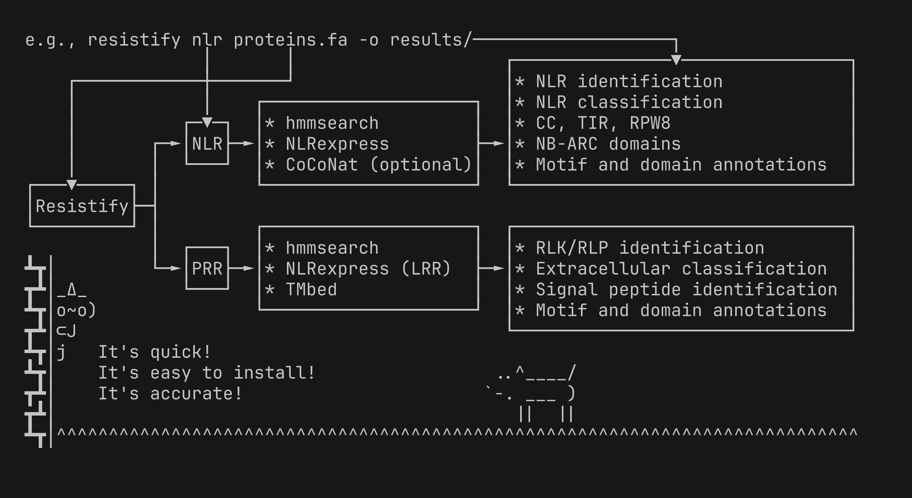
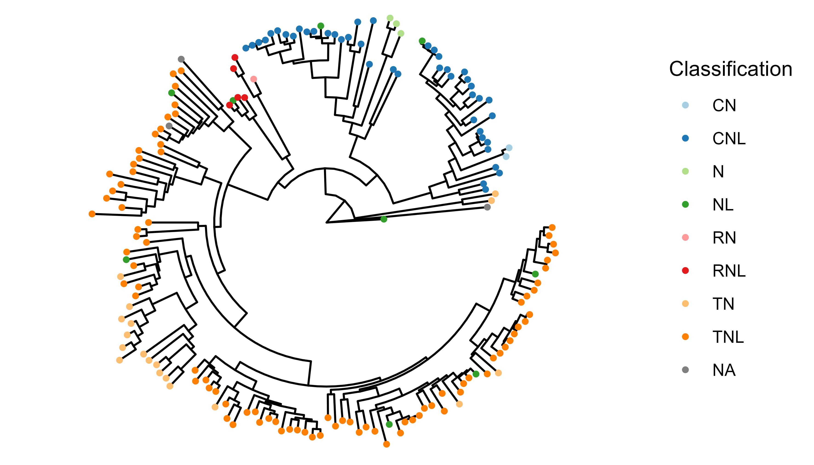

# Resistify 🍃


[](https://colab.research.google.com/github/swiftseal/resistify/blob/main/assets/resistify.ipynb)

*More than 2,500 downloads - thank you all!*

Resistify is a program which rapidly identifies and classifies plant resistance genes from protein sequences.
It is designed to be lightweight and easy to use.



## What's new in v0.6.0?

The release of `v0.6.0` has brought a number of changes to `Resistify`.
First, you'll note that there are now two modes available - NLR and PRR - which identify NLRs and PRRs respectively.

The NLR pipeline is largely the same, but has received multiple performance improvements which should allow it to utilise more threads simultaneously and significantly reduce memory usage.
As a result of these changes, the `--threads` mode has now been removed which was a bit of a lie anyway, as numpy would use them all regardless.
The `--ultra` setting has been renamed as `--retain`.

The PRR pipeline is new to `Resistify` and is currently in development.
It uses a re-implementation of [TMbed](https://github.com/BernhoferM/TMbed) to predict transmembrane domains, from which it will identify and classify RLP/RLKs according to a [recently described classification system](https://doi.org/10.1016/j.molp.2024.02.014).
Feel free to give it a try and offer suggestions!
Due to other commitments I can't currently benchmark this properly and make no guarantees to its accuracy yet.

## Installation

`Resistify` is available via the [Bioconda](https://anaconda.org/bioconda/resistify) channel:

```
conda create -n resistify bioconda::resistify
conda activate resistify
```

When using `conda`, please ensure that your Bioconda has been [configured correctly](https://bioconda.github.io/#usage).

Docker/Podman containers are also available through the [biocontainers repository](https://quay.io/repository/biocontainers/resistify?tab=tags).
To use these with - for example - `singularity`, simply run:

`singularity exec docker://quay.io/biocontainers/resistify:<tag-goes-here>`

If you are having issues with `conda`, you can instead try installing directly from the repository:

```sh
pip install https://github.com/SwiftSeal/resistify/archive/refs/tags/v0.6.2.tar.gz
```

Note that `resistify` requires `hmmer` to be installed and available in your system's PATH, which will not be installed automatically when using `pip`.

## Usage

### Identifying NLRs

To predict NLRs within a set of protein sequences, simply run:

```
resistify nlr <input.fa>
```
and `Resistify` will identify and classify NLRs, and return some files:
 - `results.tsv` - A table containing the primary results of `Resistify`.
 - `motifs.tsv` - A table of all the NLR motifs identified for each sequence.
 - `domains.tsv` - A table of all the domains identified for each sequence.
 - `annotations.tsv` - A table of the raw annotations for each sequence.
 - `nbarc.fasta` - A fasta file of all the NB-ARC domains identified.
 - `nlr.fasta` - A fasta file of all NLRs identified.

By default, `Resistify` will only return sequences with NB-ARC domains.
If you wish to identify highly fragmented NLRs, you can use the `--retain` option which will predict and report NLR-associated motifs for all sequences.
It'll be a bit slower!

If you want to increase the sensitivity of coiled-coil domain annotation, you can use the option `--coconat`.
This will use [CoCoNat](https://doi.org/10.1093/bioinformatics/btad495) to predict coiled-coil domains.
In practice, I wouldn't expect this mode to pick up on a significant number of missed CC domains, but it can pick up on cryptic CCs that do not have an identifiable EDVID motif.

#### How does it work?

`Resistify` carries out an initial search for common NLR domains to quickly filter and annotate the input sequences.
Then, `Resistify` executes a re-implementation of `NLRexpress` to conduct a highly accurate search for NLR-associated motifs.
If `--coconat` is used, this will also be executed to scavenge for potentially missed coiled-coil domains. 

### Identifying PRRs

To predict PRRs within a set of protein sequences, simply run:

```
resistify prr <input.fa>
```

and `Resistify` will identify and classify PRRs, and return some files:
 - `results.tsv` - A table containing the primary results of `Resistify`.
 - `motifs.tsv` - A table of all the LRR motifs identified for each sequence.
 - `domains.tsv` - A table of all the domains identified for each sequence.
 - `annotations.tsv` - A table of the raw annotations for each sequence.
 - `prr.fasta` - A fasta file of all PRRs identified.

 This mode uses [TMBed](https://doi.org/10.1186/s12859-022-04873-x) to predict transmembrane domains.
 It greatly benefits from GPU acceleration - running with CPUs only will be extremely slow and memory intensive.

### Downloading model data

By default, `Resistify` will automatically download the models required for CoConat and TMbed to your `$HOME/.cache` directory.
If you'd like to manually install the databases instead, you can use the `resistify download_models` utility to download these to a directory of your choice.
To provide these local models to the CoCoNat and TMbed processes, simply pass the path of the models directory via the `--models` argument.
Approximately 13G of disk space is required.
If you only intend to use the NLR module without `--coconat`, no external databases will be downloaded.

## Results

### results.tsv (nlr)

| Sequence | Length | Motifs | Domains | Classification | NBARC_motifs | MADA | MADAL | CJID |
| --- | --- | --- | --- | --- | --- | --- | --- | --- |
| ZAR1 | 852 | CNNNNNNNNNLLLLLLLLLL | mCNL | CNL | 9 | False | True | False |

The main column of interest is "Classification", where we can see that it has been identified as a canonical CNL.
The "Motifs" column indicates the series of NLR-associated motifs identified across the sequence - this can be useful if an NLR has an undetermined or unexpected classification.
The columns "MADA", "MADAL", and "CJID" correspond to common NLR sequence signatures.
Here, it appears that ZAR1 has a MADA-like motif.

### results.tsv (prr)

| Sequence | Length | Type | Classification | Signal_peptide |
| --- | --- | --- | --- | --- |
| fls2 | 1174 | RLK | LRR | True |

For PRRs, sequences can be of the type RLP or RLK - both are single pass transmembrane proteins, and RLKs have an internal kinase domain.
Classification refers to the domains identified in the external region.
If multiple domains are identified, they will each be reported as a semi-colon separated list.
If a signal peptide is identified in the sequence, this is reported accordingly.

### motifs.tsv

| Sequence | Motif | Position | Probability | Downstream_sequence | Motif_sequence | Upstream_sequence |
| --- | --- | --- | --- | --- | --- | --- |
| ZAR1 | extEDVID | 65 | 0.9974 | LVADL | RELVYEAEDILV | DCQLA |
| ZAR1 | VG | 159 | 0.9924 | YDHTQ | VVGLE | GDKRK |
| ZAR1 | P-loop | 188 | 1.0 | IMAFV | GMGGLGKTT | IAQEV |
| ZAR1 | RNSB-A | 211 | 0.9981 | EIEHR | FERRIWVSVS | QTFTE |
| ZAR1 | Walker-B | 259 | 0.973 | QYLLG | KRYLIVMD | DVWDK |
| ZAR1 | RNSB-B | 290 | 0.9846 | RGQGG | SVIVTTR | SESVA |
| ZAR1 | RNSB-C | 317 | 0.9994 | HRPEL | LSPDNSWLLF | CNVAF |
| ZAR1 | RNSB-D | 417 | 0.9875 | SHLKS | CILTLSLYP | EDCVI |
| ZAR1 | GLPL | 356 | 0.9998 | VTKCK | GLPLT | IKAVG |
| ZAR1 | MHD | 486 | 0.9965 | IITCK | IHD | MVRDL |
| ZAR1 | LxxLxL | 511 | 0.9398 | PEGLN | CRHLGI | SGNFD |
| ZAR1 | LxxLxL | 560 | 0.9973 | TDCKY | LRVLDI | SKSIF |
| ZAR1 | LxxLxL | 587 | 0.9993 | ASLQH | LACLSL | SNTHP |
| ZAR1 | LxxLxL | 611 | 0.9995 | EDLHN | LQILDA | SYCQN |
| ZAR1 | LxxLxL | 635 | 0.999 | VLFKK | LLVLDM | TNCGS |
| ZAR1 | LxxLxL | 685 | 0.9987 | KNLTN | LRKLGL | SLTRG |
| ZAR1 | LxxLxL | 712 | 0.9723 | INLSK | LMSISI | NCYDS |
| ZAR1 | LxxLxL | 740 | 0.9995 | TPPHQ | LHELSL | QFYPG |
| ZAR1 | LxxLxL | 765 | 0.9976 | HKLPM | LRYMSI | CSGNL |
| ZAR1 | LxxLxL | 817 | 0.9391 | QSMPY | LRTVTA | NWCPE |

Here, the positions, probabilities, and sequence of NLRexpress motif hits are listed.
The five amino acids upstream and downstream of the motif site are also provided.
In PRR mode, only LRR motifs will be reported.

### domains.tsv

| Sequence | Domain | Start | End |
| --- | --- | --- | --- |
| ZAR1 | MADA | 0 | 21 |
| ZAR1 | CC | 4 | 129 |
| ZAR1 | NB-ARC | 162 | 410 |
| ZAR1 | LRR | 511 | 817 |

This file contains the coordinates of the domains identified by `Resistify`.

### annotations.tsv

| Sequence | Domain | Start	| End	| E_value	| Score	| Source |
| --- | --- | --- | --- | --- | --- | --- |
| ZAR1 | MADA	| 0 |	21 | 1.5e-06 |	16.2 | HMM |
| ZAR1 | CC	| 4	| 128	| 2.3e-23	| 70.0	| HMM |
| ZAR1 | CC | 27 | 48 | NA | NA | Coconat |
| ZAR1 | CC | 60 | 75 | NA | NA | Coconat |
| ZAR1 | CC | 113 | 129 | NA | NA | Coconat |
| ZAR1 | NB-ARC	| 162 | 410 |	1.4e-89 |	287.2 |	HMM |
| ZAR1 | LRR | 511 | 817 |	NA |	NA |	NLRexpress |

This file contains the raw annotations for each sequence, and the method which was used to identify them.

## Output visualisation

I've kept the output files of `Resistify` fairly minimal so that users can carry out their own analysis/visualisation.
Here are some examples of how `Resistify` can be used to create basic plots.

### Phylogenetics

`Resistify` extracts the NB-ARC domains of each hit so we can easily build a phylogenetic tree.
Here, we create a tree rooted on the NB-ARC domain of [CED-4](https://www.uniprot.org/uniprotkb/P30429/entry).
The `mafft | fastree` method is used here for brevity rather than accuracy.

```{bash}
echo -e ">ced4\nREYHVDRVIKKLDEMCDLDSFFLFLHGRAGSGKSVIASQALSKSDQLIGINYDSIVWLKDSGTAPKSTFDLFTDILLMLARVVSDTDDSHSITDFINRVLSRSEDDLLNFPSVEHVTSVVLKRMICNALIDRPNTLFVFDDVVQEETIRWAQELRLRCLVTTRDVEISNAASQTCEFIEVTSLEIDECYDFLEAYGMPMPVGEKEEDVLNKTIELSSGNPATLMMFFKSCEPKTFEKMAQLNNKLESRGLVGVECITPYSYKSLAMALQRCVEVLSDEDRSALAFAVVMPPGVDIPVKLWSCVIPVD" >> output/nbarc.fasta

mafft output/nbarc.fasta | fasttree > output/nbarc.tree
```

We can now plot the tree:

```{R}
library(tidyverse)
library(ggtree)

tree <- read.tree("output/nbarc.tree")
tree <- treeio::root(tree, outgroup = "ced4")

results <- read_tsv("output/results.tsv") |>
  mutate(Sequence = paste0(Sequence, "_1"))

myplot <- ggtree(tree, layout = "circular") %<+% results

myplot <- myplot +
  geom_tippoint(aes(colour = Classification))
```



### Domain plotting

Sometimes, it might be of interest to plot the distribution of domains and motifs across each NLR.
Achieving this with `Resistify` is quite simple:

```{R}
library(tidyverse)

motif_translation = c(
  "extEDVID" = "CC",
  "bA" = "TIR",
  "aA" = "TIR",
  "bC" = "TIR",
  "aC" = "TIR",
  "bDaD1" = "TIR",
  "aD3" = "TIR",
  "VG" = "NB-ARC",
  "P-loop" = "NB-ARC",
  "RNSB-A" = "NB-ARC",
  "Walker-B" = "NB-ARC",
  "RNSB-B" = "NB-ARC",
  "RNSB-C" = "NB-ARC",
  "RNSB-D" = "NB-ARC",
  "GLPL" = "NB-ARC",
  "MHD" = "NB-ARC",
  "LxxLxL" = "LRR"
)

domains <- read_tsv("output/domains.tsv")
results <- read_tsv("output/results.tsv")
motifs <- read_tsv("output/motifs.tsv") |>
  mutate(Domain = motif_translation[Motif])

myplot <- ggplot() +
  geom_segment(data = results, aes(y = Sequence, yend = Sequence, x = 0, xend = Length)) +
  geom_segment(data = domains, aes(y = Sequence, yend = Sequence, x = Start, xend = End, colour = Domain)) +
  geom_point(data = motifs, aes(y = Sequence, x = Position, colour = Domain))
```


*Cute! NB: Some false-positive motif hits are evident in this example - it might be of interest to not plot them, or plot only LRR motifs which tend to be a bit more informative.*

## Frequently asked questions

**Q: Can `Resistify` be used to predict resistance genes from genomic data?**

**A:** Unfortunately, `Resistify` cannot be directly applied to a genome to predict resistance genes, unlike tools such as `NLR-Annotator`.
If gene annotations are unavailable for your genome, my advice would be to use a tool like [`Helixer`](https://github.com/weberlab-hhu/Helixer) to perform *ab initio* gene prediction.

**Q: According to the Motif string, some of my genes have NLR motifs in unexpected places - are these significant?**

**A:** False positives do occur for the motif predictions, and unexpected predictions such as a single CC motif in the LRR domain are unlikely to be representative of a true domain annotation.
You can find a figure of the prediction accuracy rates for each predictor [here](https://www.frontiersin.org/files/Articles/975888/fpls-13-975888-HTML/image_m/fpls-13-975888-g002.jpg).
False positives shouldn't interfere with the classification accuracy.

## Contributing

Contributions are greatly appreciated!
If you experience any issues running Resistify, please get in touch via the Issues page.
If you have any suggestions for additional features, get in touch!

## Citing

> Smith, M., Jones, J. T., & Hein, I. (2024). Resistify - A rapid and accurate annotation tool to identify NLRs and study their genomic organisation. *bioRxiv*, 2024-02. https://doi.org/10.1101/2024.02.14.580321

You must also cite:

> Martin, E. C., Spiridon, L., Goverse, A., & Petrescu, A. J. (2022). NLRexpress—A bundle of machine learning motif predictors—Reveals motif stability underlying plant Nod-like receptors diversity. *Frontiers in Plant Science*, 13, 975888. https://doi.org/10.3389/fpls.2022.975888

If you use the CoCoNat module, please cite:

> Madeo, G., Savojardo, C., Manfredi, M., Martelli, P. L., & Casadio, R. (2023). CoCoNat: a novel method based on deep learning for coiled-coil prediction. *Bioinformatics*, 39(8), btad495. https://doi.org/10.1093/bioinformatics/btad495

If you use the PRR module, please cite:

> Bernhofer, M., & Rost, B. (2022). TMbed: transmembrane proteins predicted through language model embeddings. *BMC bioinformatics*, 23(1), 326. https://doi.org/10.1186/s12859-022-04873-x
